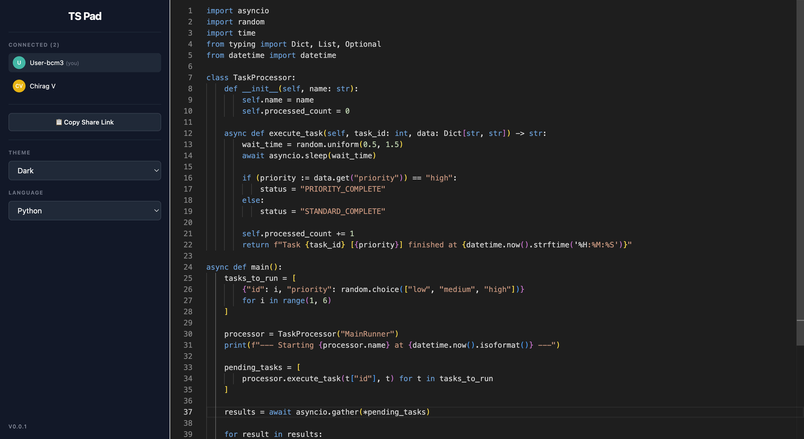

# TS Pad

TS Pad is a lightweight, real-time collaborative editor. It uses Conflict-free Replicated Data Types (CRDTs) to ensure consistent state across all users. It is inspired by [Rustpad](https://github.com/ekzhang/rustpad).

A hosted example is available at [https://chiragvijay.com/editor](https://chiragvijay.com/editor) (deployed using [Render](https://render.com)).



## Core Features

- **Real-time Synchronization**: Beyond code editing, updates such as user renaming and language selection are reflected across all connected clients in real-time using Yjs/CRDTs.
- **Language Support**: Comprehensive support for over 20 languages including TypeScript, Python, and Rust. Document language changes are synchronized instantly for all participants.
- **Live Cursors**: Visualize collaborator activity with real-time colored cursors.
- **Customizable Themes**: Support for Light, Dark, and High Contrast themes.
- **Instant Sharing**: Simplified collaboration via URL sharing. Document sessions are created dynamically and persist as long as users are active.

### This project was built using:

- **Bun Runtime**: Uses Bun for both the server-side logic and as a bundler for the frontend.
- **Monaco Editor**: Integrated the same editor that powers VS Code, providing features like IntelliSense, code navigation, and advanced syntax highlighting.
- **CRDT Sync**: Implemented synchronization using custom CRDT implementation/Yjs to handle document updates without a central authority resolving conflicts.
- **WebSockets**: High-performance real-time communication using Bun's native WebSocket implementation.

### Getting Started

To run the project locally:

1. Install [Bun](https://bun.sh).
2. Clone the repository.
3. Install dependencies:
   ```bash
   bun install
   ```
4. Start the development server:
   ```bash
   bun run dev
   ```
5. Open `http://localhost:3000` in your browser.
